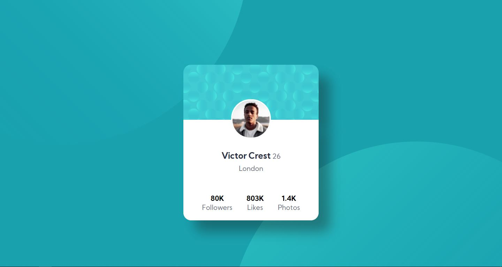

# Frontend Mentor - Profile card component solution

This is a solution to the [Profile card component challenge on Frontend Mentor](https://www.frontendmentor.io/challenges/profile-card-component-cfArpWshJ). Frontend Mentor challenges help you improve your coding skills by building realistic projects.

## Table of contents

- [Overview](#overview)
  - [The challenge](#the-challenge)
  - [Screenshot](#screenshot)
  - [Links](#links)
- [My process](#my-process)
  - [Built with](#built-with)
- [Author](#author)

## Overview

### The challenge

- Build out the project to the designs provided

### Screenshot

### Links

- Solution URL: [My solution](https://emirmoretti.github.io/profileCard/)
### Built with

- Semantic HTML5 markup
- CSS custom properties
- Mobile-first workflow
## Author

- Frontend Mentor - [@emirmoretti](https://www.frontendmentor.io/profile/emirmoretti)
- Twitter - [@emirmoretti](https://www.twitter.com/emirmoretti)
- Instagram - [@emirmoretti](https://www.instagram.com/emirmoretti)